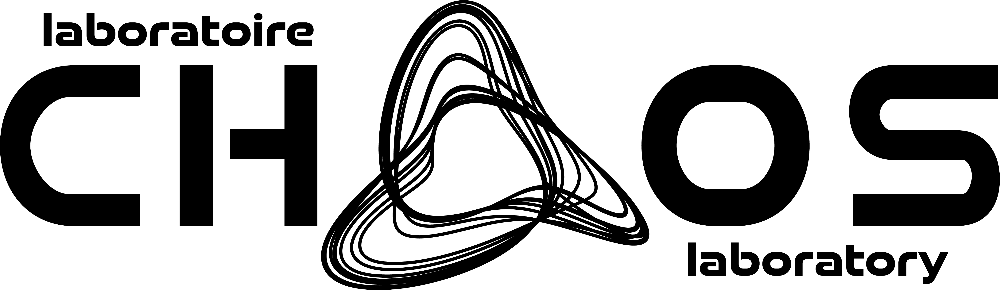

---
hide:
  - navigation
---

<h1 style="display: flex; flex-wrap: wrap; align-items: center; justify-content: space-between;">
  Outils pour l'enseignement du génie chimique
  
  
</h1>

Cette page regroupe certains outils servant 
---

*For more information, please explore the navigation menu above.*
